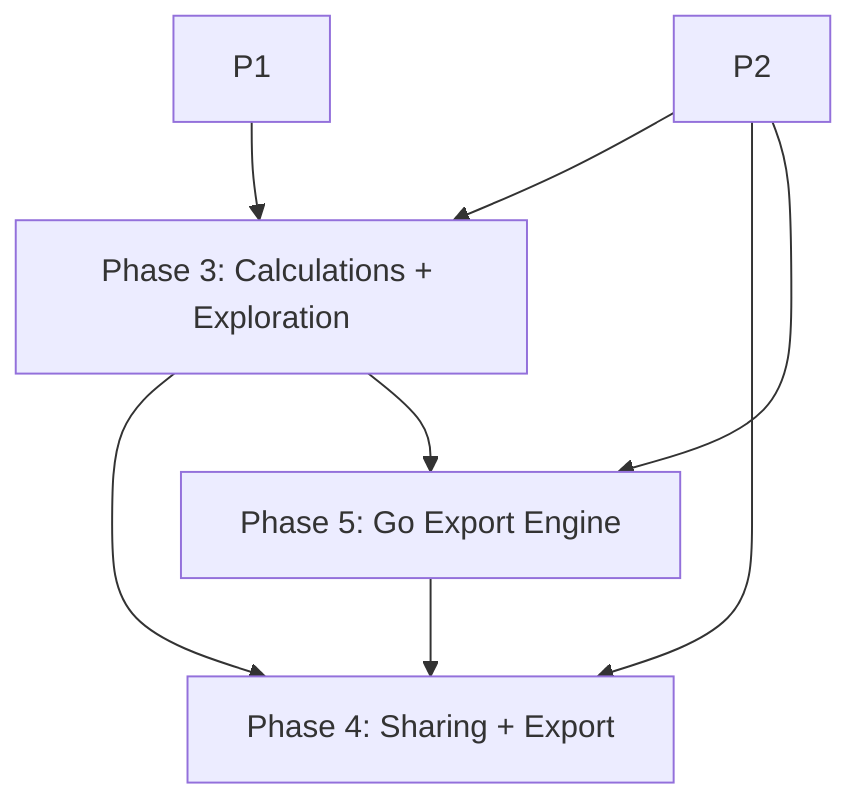

# Advanced Reporting Enhancement Implementation Plan

## Purpose

This document is the implementation plan for extending the current Forge report
builder into a stronger advanced reporting platform that moves meaningfully
toward a Tableau/Looker-like experience.

This is not a greenfield analytics-platform proposal.

It assumes the current Forge reporting foundation is the base:

- report builder:
  [ReportBuilder.jsx](/Users/awitas/go/src/github.com/viant/forge/src/components/dashboard/ReportBuilder.jsx)
- chart runtime:
  [Chart.jsx](/Users/awitas/go/src/github.com/viant/forge/src/components/Chart.jsx)
- dashboard/report blocks:
  [DashboardBlocks.jsx](/Users/awitas/go/src/github.com/viant/forge/src/components/dashboard/DashboardBlocks.jsx)
- report-builder state and helpers:
  [reportBuilderUtils.js](/Users/awitas/go/src/github.com/viant/forge/src/components/dashboard/reportBuilderUtils.js),
  [reportBuilderHooks.js](/Users/awitas/go/src/github.com/viant/forge/src/components/dashboard/reportBuilderHooks.js),
  [reportBuilderPersistence.js](/Users/awitas/go/src/github.com/viant/forge/src/components/dashboard/reportBuilderPersistence.js),
  [reportBuilderResultData.js](/Users/awitas/go/src/github.com/viant/forge/src/components/dashboard/reportBuilderResultData.js)
- datasource plumbing:
  [dataSource.js](/Users/awitas/go/src/github.com/viant/forge/src/hooks/dataSource.js),
  [parameters.js](/Users/awitas/go/src/github.com/viant/forge/src/hooks/parameters.js),
  [Context.jsx](/Users/awitas/go/src/github.com/viant/forge/src/core/context/Context.jsx)

This plan also assumes the current report-builder implementation is complete
enough to serve as the base layer:

- [forecasting-plan-requirement-audit-2026-06-11.md](/Users/awitas/go/src/github.com/viant/agently/ui/test-results/forecasting-plan-requirement-audit-2026-06-11.md)

Detailed phase expansions live in:

- [README.md](/Users/awitas/go/src/github.com/viant/forge/advence-reporting/README.md)
- [phase-1-semantic-modeling-layer.md](/Users/awitas/go/src/github.com/viant/forge/advence-reporting/phase-1-semantic-modeling-layer.md)
- [phase-2-authored-reports-and-drill-navigation.md](/Users/awitas/go/src/github.com/viant/forge/advence-reporting/phase-2-authored-reports-and-drill-navigation.md)
- [phase-3-calculated-fields-and-ad-hoc-exploration.md](/Users/awitas/go/src/github.com/viant/forge/advence-reporting/phase-3-calculated-fields-and-ad-hoc-exploration.md)
- [phase-4-sharing-governance-and-export-polish.md](/Users/awitas/go/src/github.com/viant/forge/advence-reporting/phase-4-sharing-governance-and-export-polish.md)
- [phase-5-go-export-engine.md](/Users/awitas/go/src/github.com/viant/forge/advence-reporting/phase-5-go-export-engine.md)

## Inputs

Primary implementation context:

- current report-builder implementation plan:
  [forecasting-report-builder-implementation-plan.md](/Users/awitas/go/src/github.com/viant/forge/docs/forecasting-report-builder-implementation-plan.md)
- current completed-state audit:
  [forecasting-completion-audit-2026-06-10.md](/Users/awitas/go/src/github.com/viant/agently/ui/test-results/forecasting-completion-audit-2026-06-10.md)
- current requirement audit:
  [forecasting-plan-requirement-audit-2026-06-11.md](/Users/awitas/go/src/github.com/viant/agently/ui/test-results/forecasting-plan-requirement-audit-2026-06-11.md)

Product goal inputs:

- semantic modeling layer: `6-10 weeks` MVP, `3-6 months` strong version
- multi-block authored reports/dashboards: `4-8 weeks`
- drill-down / keep-only / exclude / detail navigation: `3-6 weeks`
- calculated fields and table calculations: `8-14 weeks` MVP
- ad hoc exploration workflow: `2-4 months` for good enough, `6+ months` for strong
- sharing / saved views / publishing / governance: `6-12 weeks` MVP
- export/presentation polish: `3-6 weeks`
- Go export engine / deterministic PDF backend: `8-14 weeks`

## Scope

In scope:

- semantic reporting model support in Forge
- authored report document model above the current report builder
- canonical compile/fill/render contracts
- generic drill/refinement mechanics
- local calculated fields and table calculations
- exploration session workflow
- generic sharing/publish/governance interfaces
- presentation/export polish

Out of scope:

- replacing the current report-builder stack
- building a general-purpose BI query engine in Forge
- putting business metric logic into Forge
- turning Agently into a semantic or governance engine
- implementing workspace-specific policy in the client

## Architecture Boundaries

### Forge responsibilities

Forge owns generic reporting framework capability:

- semantic model abstractions and binding state
- report document model and composer UI
- generic drill/refinement mechanics
- local calculated-field and table-calc runtime
- exploration session model
- saved-view, publish, and audit interfaces
- generic export/presentation engine

Forge must remain domain-agnostic and metadata-driven.

### Steward responsibilities

Steward owns business semantics and governance:

- semantic model content
- approved measures/dimensions/formulas
- report templates
- drill hierarchies and detail targets
- permissions, sharing policy, certification, and trust metadata
- branded labels and business copy

Steward should express this through metadata and service contracts, not through
Forge-side business logic.

### Agently responsibilities

Agently responsibilities are split between:

- `agently-core`:
  runtime services, auth-aware persistence, MCP service hosting, jobs, audit,
  and artifact storage
- `agently` app:
  deployment, app wiring, workspace hosting, and UI integration

`agently-core` owns runtime/shell concerns only:

- provider wiring
- auth, caching, transport, host routing
- headless render execution hooks
- workspace/runtime hosting
- principal-scoped persistence of reporting artifacts
- reporting MCP service hosting

Agently should not own semantic planning, business governance, or reporting
policy logic.

### mcp-ui responsibilities

`viant/mcp-ui` should be treated as a remote presentation and projection
surface for already-defined reporting artifacts.

It is appropriate for:

- `ui://...` projection of saved reports or saved views
- MCP-facing rendering of published reporting artifacts
- lightweight remote interaction with an existing report surface

It is not appropriate for:

- report authoring
- canonical persistence
- semantic model ownership
- sharing or governance policy enforcement

## Canonical Reporting Pipeline

The current dashboard grammar, `dashboard.report`, and
`dashboard.reportBuilder` remain useful, but they should be treated as
**authoring/config surfaces**, not as the final internal advanced-reporting AST.

Recommended model:

1. authoring artifacts
2. compiled report AST
3. filled report result
4. render/export plans

### Authoring Artifacts

Authoring artifacts are the current editable, backward-compatible surfaces:

- dashboard metadata from
  [dashboardCapabilities.js](/Users/awitas/go/src/github.com/viant/forge/src/core/ui/dashboardCapabilities.js)
- `dashboard.report` projection settings
- `dashboard.reportBuilder` config and saved state from
  [report-builder.md](/Users/awitas/go/src/github.com/viant/forge/docs/report-builder.md)
- Phase 2 `ReportDocument`

These remain intentionally permissive and editing-friendly.

### Compiled AST

Introduce a strict, versioned, closed-schema internal AST named
`ReportSpec`.

`ReportSpec` is the canonical meaning of a report. It is produced by compiling
authoring artifacts plus Steward metadata into:

- resolved block kinds
- resolved field bindings
- resolved labels and formats
- dataset declarations
- typed parameters
- explicit layout intent
- explicit refinement semantics

### Filled Result

Introduce a strict, layout-free filled artifact named `ReportFill`.

`ReportFill` contains:

- the exact `ReportSpec` version/hash used
- the exact parameter values used
- executed dataset requests and provenance
- resolved block content
- resolved chart/table/geo payloads
- truncation markers and diagnostics

`ReportFill` is the canonical filled result and the correct basis for
published-snapshot reproducibility.

### Render / Export Plans

Rendering is phase-separated from meaning and data.

- web engine:
  renders `ReportSpec` + `ReportFill` for interactive preview/runtime use
- Go export engine:
  converts `ReportFill` into a paginated print model named `ReportPrint`
  and exports production artifacts such as PDF

Important rule:

- compile owns meaning
- fill owns data
- render owns geometry

No phase may do another phase's job.

### Compile / Fill Ownership Decision

To avoid two reporting brains, ownership should be explicit:

- canonical compile is owned by the backend reporting service hosted through
  `agently-core`
- canonical fill is owned by the same backend reporting service
- Forge may retain lightweight local authoring previews during editing, but
  those previews are convenience/runtime behavior, not the source of truth for
  saved, published, or exported artifacts

Required rule:

- save, publish, and export paths must pass through canonical compile/fill
- any interactive local preview that diverges from canonical compile/fill is a
  bug and must be detected by conformance fixtures

That means the real parity contract is:

1. author in Forge
2. canonical compile/fill validates and materializes the authoritative result
3. web preview and Go export both consume canonical artifacts for durable flows

### Dashboard and Report Builder Reconciliation

The reconciled relationship should be:

- dashboard grammar:
  authoring/config surface
- `dashboard.report`:
  report projection directive over dashboard blocks
- `dashboard.reportBuilder`:
  authored analytical input surface and saved builder state
- `ReportDocument`:
  authored saved multi-block artifact
- `ReportSpec`:
  strict internal AST lowered from any of the above

This preserves backward compatibility while ensuring only one canonical
advanced-reporting model exists internally.

## Red Lines

The following are explicitly not allowed:

- business measure definitions inside Forge source
- semantic query planning inside Agently
- workspace policy logic inside Forge or Agently
- report authoring or persistence logic inside `mcp-ui`
- report artifact persistence inside `forge/backend`
- a second principal/identity system outside `agently-core` auth
- greenfield BI runtime rewrite inside Forge
- ad hoc business heuristics that reinterpret field meaning
- silent fallback behavior that hides invalid report state
- duplication of datasource dependency semantics in a second reporting engine
- compile-time business logic leakage into export/runtime layers
- fill-time layout decisions
- layout-time data interpretation or query planning
- exporter-conditional behavior in `ReportSpec` or `ReportFill`
- production PDF that depends on a browser session or headless browser as the
  canonical engine

## Current Foundation

The current Forge reporting stack already provides:

- strong single-report analytical authoring
- explicit chart editor and chart-family validation
- dashboard/report block composition
- datasource dependency propagation
- compact/mobile reporting interactions
- report/document persistence building blocks
- current export/report rendering primitives

The main missing capability is the **analytics product layer above the report
builder**, not datasource chaining or base chart rendering.

## Desired End State

Forge should support a reporting platform where users can:

1. build reports from governed semantic fields
2. compose multi-block report documents
3. refine data through drill/keep/exclude flows
4. create local calculated fields and table calculations
5. fork reports into ad hoc explorations
6. save/share/publish/report on governed artifacts
7. export polished report deliverables
8. render analytical tables with inline visuals such as horizontal data bars
   and rule-based coloring

## Implementation Plan

### Phase 1

Goal:

- introduce a semantic reporting layer above raw datasources without moving
  business logic into Forge

Detailed phase document:

- [phase-1-semantic-modeling-layer.md](/Users/awitas/go/src/github.com/viant/forge/advence-reporting/phase-1-semantic-modeling-layer.md)

Core implementation deliverables:

1. generic semantic model schema and model reference types
2. Forge-side provider interface for semantic model resolution
3. semantic-binding mode in report definitions and builder state
4. semantic-aware field palette, labels, formats, and governance badges
5. backward-compatible coexistence with raw datasource binding

Pushback already applied:

- semantic selection to physical query execution must be resolved by a
  Steward/backend semantic service, not by Agently logic and not by Forge as a
  business engine

Likely new modules:

- `src/semantic/modelSchema.js`
- `src/semantic/modelRef.js`
- `src/semantic/modelProvider.js`
- semantic-aware report-builder UI/state modules

Acceptance criteria:

- reports can bind to semantic models without breaking raw-mode reports
- semantic labels and formats flow through current chart/table/report surfaces
- governance annotations are rendered generically
- Forge does not contain business metric expressions

Effort notes:

- MVP: `6-10 weeks`
- strong version: `3-6 months`

### Phase 2

Goal:

- evolve the current report-builder + dashboard blocks into authored, saveable
  multi-block report documents with generic drill/refinement navigation

Detailed phase document:

- [phase-2-authored-reports-and-drill-navigation.md](/Users/awitas/go/src/github.com/viant/forge/advence-reporting/phase-2-authored-reports-and-drill-navigation.md)

Core implementation deliverables:

1. `ReportDocument` schema and document persistence interface
2. `ReportComposer` UI built over existing dashboard/report rendering
3. document-level scope and block-level scope bindings
4. generic refinement model for keep/exclude/drill/detail
5. visible refinement chip/breadcrumb trail
6. rich table block semantics including inline cell visuals
7. opaque detail navigation intents resolved by the host

Pushback already applied:

- Forge should not define business drill hierarchies
- templates remain metadata/content supplied by Steward, not executable Forge logic
- `ReportDocument` persistence must wrap and extend the current reporting
  persistence patterns instead of introducing a second parallel persistence
  system

Likely new modules:

- `src/reporting/reportDocumentModel.js`
- `src/reporting/reportDocumentStore.js`
- `src/components/dashboard/ReportComposer.jsx`
- `src/components/dashboard/RefinementBar.jsx`
- `src/components/dashboard/detailNavigation.js`
- `src/reporting/drillMetadataProvider.js`

Acceptance criteria:

- users can create, save, reload, and edit multi-block reports
- shared scope updates bound blocks correctly
- keep/exclude/drill actions are visible and reversible
- table blocks can express deterministic inline data bars and rule-driven cell
  coloring without business logic leakage
- detail navigation routes through host-provided targets

Effort notes:

- authored reports: `4-8 weeks`
- drill/navigation: `3-6 weeks`

### Phase 3

Goal:

- add analyst-grade derived calculation and scratchpad exploration without
  turning Forge into a greenfield BI engine

Detailed phase document:

- [phase-3-calculated-fields-and-ad-hoc-exploration.md](/Users/awitas/go/src/github.com/viant/forge/advence-reporting/phase-3-calculated-fields-and-ad-hoc-exploration.md)

Core implementation deliverables:

1. closed expression grammar for local/ad hoc calculations
2. row-level calculated fields
3. post-aggregation table calculations
4. calculated-field authoring UI inside the current builder/exploration flow
5. ephemeral exploration session model and workspace
6. save-as-report and discard flows from exploration

Pushback already applied:

- governed business formulas should remain Steward-owned references
- Forge’s local evaluator should be limited to local/ad hoc formulas and table
  calculations, not the canonical execution of approved business semantics
- Agently should host or route saved-report execution, not become the
  reporting execution engine itself
- no collaborative exploration or cross-source formula engine in the MVP

Likely new modules:

- `src/expr/*`
- `src/reporting/calcFieldSpec.js`
- `src/reporting/tableCalcSpec.js`
- `src/reporting/explorationSession.js`
- `src/components/dashboard/CalculatedFieldEditor.jsx`
- `src/components/dashboard/ExplorationWorkspace.jsx`

Acceptance criteria:

- local calculations work across chart/table/report contexts
- supported table calculations persist and render consistently
- exploration can fork from a report or dashboard tile and save as a new report
- governed formulas can surface as references from Steward

Effort notes:

- calculations MVP: `8-14 weeks`
- ad hoc exploration: `2-4 months` for good enough

### Phase 4

Goal:

- turn authored reports into governed shared artifacts with presentation-grade
  sharing, publish, and web-side export polish

Detailed phase document:

- [phase-4-sharing-governance-and-export-polish.md](/Users/awitas/go/src/github.com/viant/forge/advence-reporting/phase-4-sharing-governance-and-export-polish.md)

Core implementation deliverables:

1. generic `Shareable` envelope for reporting artifacts
2. saved-view overlay model
3. sharing UI and provider interfaces
4. publish lifecycle UI and immutable published snapshot support
5. governance badge rendering and audit hooks
6. web-side export fidelity improvements and theme hooks
7. optional downstream `mcp-ui` projection of published reports and saved views

Pushback already applied:

- permission and approval logic stay out of Forge
- export scheduling/distribution stay out of Forge MVP
- Agently hosts runtime/render hooks only
- `mcp-ui` may project published reports and saved views remotely, but it is a
  consumption surface only, not an authoring or storage layer
- production-grade PDF/export backend work is delegated to Phase 5

Likely new modules:

- `src/reporting/sharing/*`
- `src/reporting/views/*`
- `src/reporting/lifecycle/*`
- `src/reporting/audit/*`
- `src/reporting/export/*`

Acceptance criteria:

- share/publish flows work through provider interfaces
- published versions are immutable
- saved views reproduce state cleanly
- exported output is presentation-grade and reproducible
- inline visual table cells preserve intended tone/data-bar semantics in
  published/exported views
- audit events are emitted for share/publish/export operations

Effort notes:

- sharing/governance MVP: `6-12 weeks`
- export/presentation polish: `3-6 weeks`

### Phase 5

Goal:

- add a Go-backed deterministic export engine that produces production-grade
  paginated PDF and other backend-owned export artifacts from the canonical
  compile/fill pipeline

Detailed phase document:

- [phase-5-go-export-engine.md](/Users/awitas/go/src/github.com/viant/forge/advence-reporting/phase-5-go-export-engine.md)

Core implementation deliverables:

1. closed JSON schemas for `ReportSpec`, `ReportFill`, and `ReportPrint`
2. one canonical compile/fill pipeline shared by web and backend engines
3. Go backend module/service for compile, fill, layout, and export orchestration
4. paginated `ReportPrint` model for deterministic backend rendering
5. PDF export writer plus tabular export writers that consume canonical models
6. async export jobs, artifact storage, and audit hooks via `agently-core`
7. conformance fixtures and deterministic export regression coverage

Pushback already applied:

- the Go phase must not become a second reporting engine
- the Go phase must not read authoring grammar directly
- all business meaning must already be resolved before export/layout
- production PDF must not depend on browser rendering as the canonical path

Likely new modules:

- Forge:
  `src/reporting/schema/*`
- Forge stateless backend/library:
  `backend/reporting/{spec,compile,fill,layout,print,export}`
- `agently-core` runtime/service:
  `service/reporting/*`, Datly-backed stores, MCP handlers, jobs, audit
- `agently` app wiring:
  handler registration, deployment/runtime integration

Acceptance criteria:

- one `ReportSpec` can drive both web preview and backend export
- the same `ReportSpec` + parameters + data produce the same `ReportFill`
- backend PDF output is reproducible and paginated correctly
- export jobs run asynchronously and store artifacts cleanly
- unsupported constructs fail visibly rather than silently degrading

Effort notes:

- Go export engine / deterministic PDF backend: `8-14 weeks`

## Delivery Order

Recommended delivery order:

1. Phase 1 semantic modeling
2. Phase 2 authored reports and drill navigation
3. Phase 3 calculations and exploration
4. Phase 5 Go export engine
5. Phase 4 sharing, governance, and export polish

Dependency graph:

Important reconciliation:

- Phase 2 can begin in parallel with Phase 1 because authored report documents
  and refinement mechanics still work over raw-mode reports.
- Phase 3 exploration depends on the Phase 2 report document model and saveable
  authored artifacts, so it should not be treated as independent of Phase 2.
- Phase 5 should not be hidden inside export polish because it is the first
  backend proof that the canonical AST/fill model is complete and sufficient
  without browser-only logic.
- Phase 4 governance, saved views, and lifecycle work can begin before Phase 5
  is fully complete, but production-grade PDF/export completion in Phase 4
  depends on Phase 5 delivery.

## Interface Freeze Gates

Before parallel implementation starts, the following contracts should be frozen
enough for cross-team work:

1. semantic provider transport/auth contract
2. `ReportSpec` / `ReportFill` / `ReportPrint` draft schemas
3. expression grammar MVP and conformance corpus format
4. report document persistence contract
5. sharing/lifecycle/capability provider contracts

These do not all need final production polish before coding begins, but they do
need stable first drafts so Forge, Steward, and Agently teams do not invent
competing seams.

## Verification Plan

Cross-phase verification should include:

### Unit coverage

- semantic model validation and reference parsing
- `ReportSpec` schema validation and migrations
- `ReportFill` determinism and provenance checks
- `ReportPrint` pagination and layout rules
- report document schema and migrations
- refinement predicate composition
- expression parsing and calculation runtime
- saved-view overlay merge semantics
- lifecycle state machine and export template behavior

### Integration coverage

- semantic-bound report -> chart -> dashboard flow
- authored report document save/reload/edit flow
- drill/refinement behavior across chart and table surfaces
- exploration fork/save/promote flow
- share/publish/view/export capability flow through providers
- compile/fill/export conformance fixtures across web and Go engines

### Browser/runtime coverage

- preview and embedded/live parity for critical authored-report flows
- desktop and compact/mobile parity
- headless export proof paths
- deterministic backend PDF proof paths

## Suggested Execution Model

Recommended staffing model:

- Forge lead for framework/state/UX delivery
- Steward lead for semantic/governance/template services
- Agently-core/runtime lead for provider wiring, auth, caching, persistence,
  MCP hosting, and headless render hooks

Recommended implementation style:

- feature-flag each major capability
- maintain backward compatibility with current raw-mode reports
- reuse current reporting surfaces wherever possible
- push execution/business policy behind host/provider boundaries
- keep dashboard/reportBuilder as authoring surfaces while making `ReportSpec`
  the only canonical internal model

## Non-Goals

The following are out of scope for the first advanced-reporting program:

- natural-language BI authoring as a primary workflow
- collaborative multi-user editing
- cross-source BI engine rewrite inside Forge
- Agently-owned semantic or governance logic
- scheduled distribution workflows inside Forge
- workspace-specific business logic in the client

## Final Recommendation

Forge is now ready to move from “strong single-report builder” to “generic
advanced reporting framework.”

The right way to do that is:

1. build the semantic foundation
2. build authored report documents and drill/refinement
3. add calculation and exploration depth
4. add governance, sharing, and polished export

That sequence preserves clean separation of concerns, leverages the current
Forge reporting foundation, and avoids the most common failure mode: trying to
reach Tableau/Looker-like capability by layering disconnected UI features
without first establishing the semantic and document foundations.
